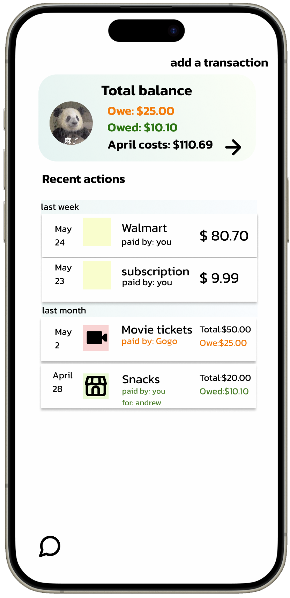

# SplitEase

## Prototype by Figma



View interactive prototype on Figma: [SplitEase](https://www.figma.com/design/42eVwTzPJYXSRaNKKPLRl1/SplitEase_Colored_for_TA?t=u83JnK5PdhNWYErF-1)

## Description

SplitEase is a mobile application designed to streamline the process of splitting bills and tracking shared expenses among multiple individuals. Whether you're dining out with friends, managing household finances with roommates, or planning group vacations, SplitEase offers a convenient solution for accurately calculating each person’s share of expenses.

## Motivation

Sharing expenses and dividing bills can often be a cumbersome and frustrating task, especially in group settings. This process frequently leads to confusion, disagreements, and unresolved debts. SplitEase was developed to alleviate these challenges by providing a user-friendly platform that simplifies the management of shared expenses. By offering features for bill splitting, expense tracking, and settling debts, SplitEase aims to eliminate the manual effort and confusion associated with managing shared expenses, ultimately promoting fairness and transparency within group finances.

## Installation

To install SplitEase, follow these steps:

1. Clone the repository to your local machine using the following command:

   ```sh
   git clone <the repo url>
   ```

2. Navigate to the project directory:
3. Install the necessary dependencies by running:

   ```sh
   npm install
   ```

4. Start the application by running:

   1. For frontend:

      ```sh
      cd frontend
      npm start
      ```

   2. For backend:

      ```sh
      cd backend
      npm start
      ```

## Running locally

1. To run the frontend locally, navigate to the `frontend` directory and run:

   ```sh
   npm start
   ```

2. Navigate to the `backend` directory and run:

   ```sh
   npm start
   ```

3. Open your browser and navigate to `http://localhost:3000/` to view the application.

## Contributing

### Create a branch

1. `git checkout main` from any folder in your local repository
2. `git pull origin main` to ensure you have the latest main code
3. `git checkout -b the-name-of-my-branch` (replacing `the-name-of-my-branch` with a suitable name) to create a branch

### Make the change

1. Follow the ["Running locally"](#running-locally) instructions
1. Save the files and check in the browser
1. Changes to React components in `src` will hot-reload
1. Changes to markdown files in `content` will hot-reload
1. If working with plugins, you may need to remove the `.cache` directory and restart the server

### Test the change

1. If possible, test any visual changes in all latest versions of common browsers, on both desktop and mobile.
2. Run `yarn check-all`. (This will run Prettier, ESLint and validate types.)

### Push it

1. `git add -A && git commit -m "My message"` (replacing `My message` with a commit message, such as `Fix header logo on Android`) to stage and commit your changes
2. `git push my-fork-name the-name-of-my-branch`
3. Go to the GitHub repository and you should see recently pushed branches.
4. Follow GitHub's instructions.
5. If possible, include screenshots of visual changes. A preview build is triggered after your changes are pushed to GitHub.

## Q&A

1. Do you use git flow?
   GitLens

2. What do you name your branches?

   - `git checkout main` from any folder in your local repository
   - `git pull origin main` to ensure you have the latest main code
   - `git checkout -b the-name-of-my-branch` (replacing -name-of-my-branch with a suitable name) to create a branch
   - Naming convention
     - `dev/version-name`
     - `feature/feature-name`
     - `bugfix/bug-name`

3. Do you use github issues or another ticketing website?

   - Version Control: Git by GitHub
   - Issue Tracking: GitHub Issues
   - Project Managing: JIRA
   - Prototype Design: Figma
   - File Sharing & Collaboration: Google Drive
   - Documentation: Google Docs
   - Communication: Slack

4. Do you use pull requests?
   Yes. The main branch is protected, and all changes must be made through pull requests. Pull requests are reviewed by at least two other team member before merging.
