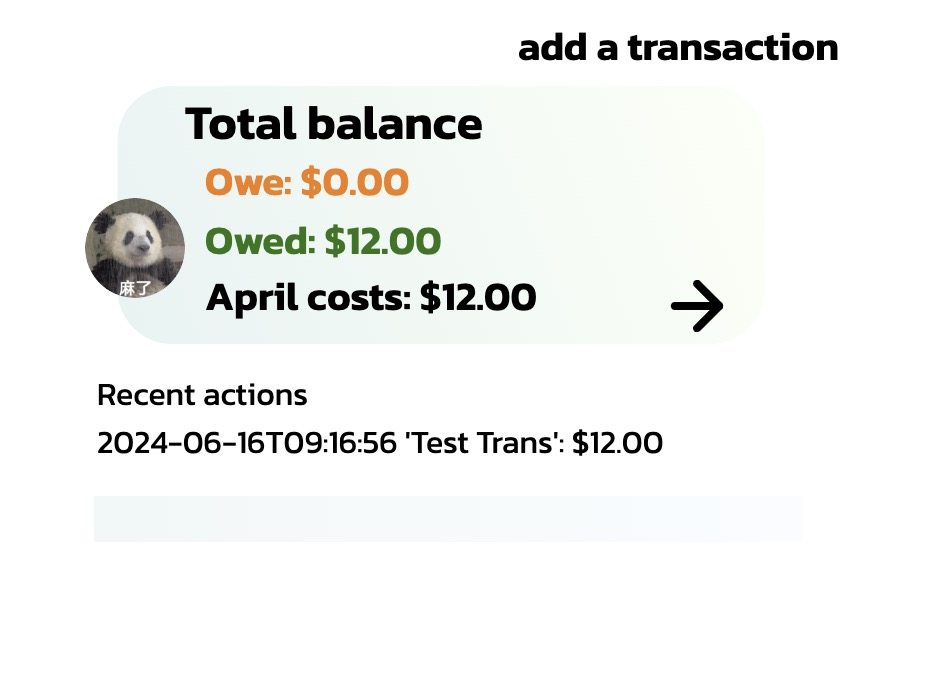

# SplitEase

 > _Note:_ This document is meant to be written during (or shortly after) your review meeting, which should happen fairly close to the due date.
 > 
 > _Suggestion:_ Have your review meeting a day or two before the due date. This way you will have some time to go over (and edit) this document, and all team members should have a chance to make their contribution.

## Iteration 01 - Review & Retrospect

* When: June 13,2024
* Where: Online via Zoom

## Process - Reflection
During iteraltion 1, we managed to setup the basic pages for our app, including two features.
Our app now features a frontend with six pages, two available features, and comprehensive backend logic.
The group worked togther with jobs assigned and each completed their assigned user stories.

#### Decisions that turned out well

1. Prioritized the development of two key features to provide immediate value and functionality to users, this is important because the product
   is led by the feature implementations, and our ultimate goal is to complete all user stories and features. Prioritizing these features
   can reveal pain points in our development and we can start fixing or optimizing early.
2. Developed a solid backend architecture to support the app's current and future features efficiently.
3. Focused on intuitive UI/UX design, ensuring a user-friendly interface for a better overall experience, we kept our style mostly the same for
   the app UI. First impressions are always important, this also applies to an App/webpage, we want our UI to be simple and graceful.

#### Decisions that did not turn out as well as we hoped

1. The hesitation between making an App or a universal platform (web) delayed the frontend development process.
2. The original choice of using react native was unnecessary and redundant because the plan changed from making an APP to making a website.
3. The programming language of using react or react native is not decided soon enough, delaying the development of frontend.

#### Planned changes
1. Changed from making an App to a website and reason is making an App is lacking support for multi-platform, while website can provide a universal access.

## Product - Review

#### Goals and/or tasks that were met/completed

1.Completed the feature of simple transactions that does not include friends or groups sharing. The total amount will be shown in the dashboard page.

2.Completed the Login/register feature, the user is able to create a new account and login, logging in requires a correct password.

#### Goals and/or tasks that were planned but not met/completed

1. We did not complete the feature of displaying the friends and groups of the current user.
  The reason why we failed to achieve this is due to the lack of react feature knowledge.
  
2. We have not yet implemented the feature of changing the user avatar.
  The reason for this is the backend features on this part are not yet implemented. 

## Meeting Highlights

Going into the next iteration, our main insights are,

We will aim to implement the following feature in our next iteration:
1. Show all friends and groups of the current user, the user can check all transactions with a friend or within a group.
2. The user can change the avatar and password.
3. The user can select how to split a transaction, with friends or group, and how to split it.

We will aim to follow the below principles and learn from our previous iteration, these are what we want to improve in the coming iteration:
1. Frontend requires more react understanding, the current frontend code includes serval shortcoming points which we aim to fix in the coming iteration. We will mainly focus on fully understanding the react pages and modifying the files into a better structure.
2. We will start earlier than then last iteration to provide ample time to improve the written prototype.
3. We will be more active in searching for solutions to our current obstacles.

