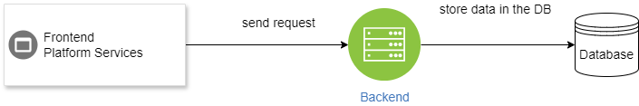

# System Design Document

## SplitEase - Bill Splitting and Expense Tracking Application

### Overview
SplitEase is a mobile application designed to streamline the process of splitting bills and tracking shared expenses among multiple individuals. The app offers a convenient solution for accurately calculating each person’s share of expenses, managing different groups, and keeping track of who owes whom. The system design outlined in this document will detail the classes, their responsibilities, interactions, system architecture, and error handling strategies.

---

### Classes (CRC Cards)

#### 1. User
**Responsibilities:**
- Register and log in
- Manage personal profile
- Create and join groups
- View and manage financial status (owe/owed)

**Collaborators:**
- Group
- Transaction

#### 2. Group
**Parent Class:** None
**Subclasses:** GroupInfo
**Responsibilities:**
- Create and manage groups
- Add and remove members
- Assign admin roles
- Track group-specific expenses

**Collaborators:**
- User
- Transaction

#### 3. Transaction
**Responsibilities:**
- Record individual transactions between users
- Track the payer, payee, and amount of each transaction
- Maintain references to associated transaction information

**Collaborators:**
- User
- Group
- Database

#### 4. Database
**Responsibilities:**
- Handle data storage and retrieval operations
- Ensure data integrity and consistency
- Interface with the backend server to store and retrieve user and transaction data

**Collaborators:**
- Transaction
  
---

### System Interaction with the Environment

**Dependencies:**
- **Operating System:** Android, iOS
- **Programming Languages:** JavaScript (React Native)
- **Database:** MongoDB
- **Network Configuration:** REST API, HTTPS for secure communication

**Assumptions:**
- Users have internet access to sync data and receive notifications.
- The app will be deployed on both Android and iOS platforms.

---
### System Architecture
The architecture of SplitEase consists of four main components:
1.  **Frontend Interface:** User-facing mobile application built using native or cross-platform frameworks.
2.  **Backend Services:** Server-side components responsible for handling authentication, data storage, and business logic (implemented using Node.js and Express.js).
3.  **Database:** Persistent storage for user profiles, expenses, transactions, and related information (MongoDB).
4.  **Database Interface:** Component responsible for interacting with the database to perform CRUD (Create, Read, Update, Delete) operations.

### System Decomposition

#### 1. Frontend Interface
-   **Role:** Responsible for presenting the user interface (UI) and handling user interactions.
-   **Detailed Design:** Implements screens for user authentication, expense management, transaction tracking, etc.
-   **Error Handling Strategy:** Display error messages for invalid user input. Implement client-side validation to prevent submission of incorrect data. Provide informative messages for network errors and guide users on how to resolve them. Implement retry mechanisms for failed network requests.

#### 2. Backend Server
-   **Role:** Handles server-side logic, including user authentication, business logic, and communication with the database.
-   **Detailed Design:** Implements RESTful APIs to handle requests from the frontend. Validates incoming data, processes requests, interacts with the database for CRUD operations, and sends responses back to the frontend.
-   **Error Handling Strategy:** Implement middleware for input validation to catch and reject invalid user input. Use try-catch blocks to handle exceptions and errors gracefully. Provide informative error messages in response to failed database operations or external service failures. Implement logging to track errors for debugging purposes.

#### 3. Database
-   **Role:** Stores and retrieves user data, expenses, transactions, and related information.
-   **Detailed Design:** Utilizes MongoDB as the backend database to store collections for users, expenses, transactions, etc. Defines schemas and indexes for efficient data storage and retrieval.
-   **Error Handling Strategy:** Utilize MongoDB's built-in error handling mechanisms to handle database errors such as duplicate key errors, connection errors, etc. Implement retry logic for transient errors. Regularly backup data to prevent data loss in case of catastrophic failures.

### Error Handling and Exceptional Cases

#### 1. Invalid User Input
-   **Response:** Display informative error messages on the frontend to notify users of invalid input. Highlight the specific fields with errors and provide guidance on how to correct them. Implement client-side validation to prevent submission of invalid data.

#### 2. Network Failure
-   **Response:** Display a user-friendly message indicating a network error and advise users to check their internet connection. Implement retry mechanisms for failed network requests to automatically attempt reconnection. Provide manual refresh options for users to trigger reconnection attempts.

#### 3. External System Failure
-   **Response:** Display informative error messages indicating the failure of external services (e.g., authentication provider, database server). Provide instructions on potential actions users can take, such as retrying later or contacting support. Implement logging to track errors and facilitate troubleshooting and resolution of issues.

By addressing these anticipated errors and exceptions with appropriate error handling strategies, SplitEase ensures a robust and reliable user experience, minimizing disruptions and providing clear guidance to users on how to resolve issues as they arise.
