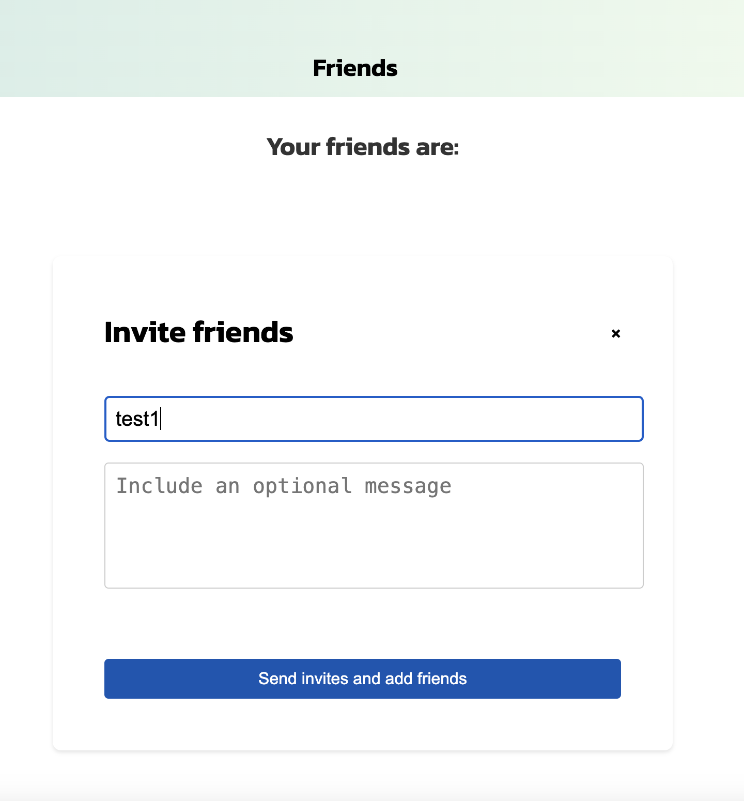
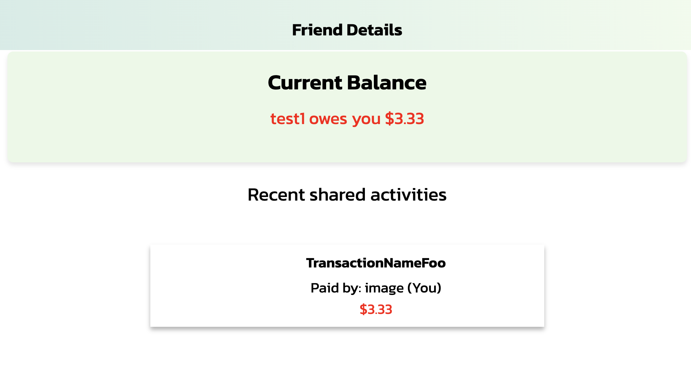
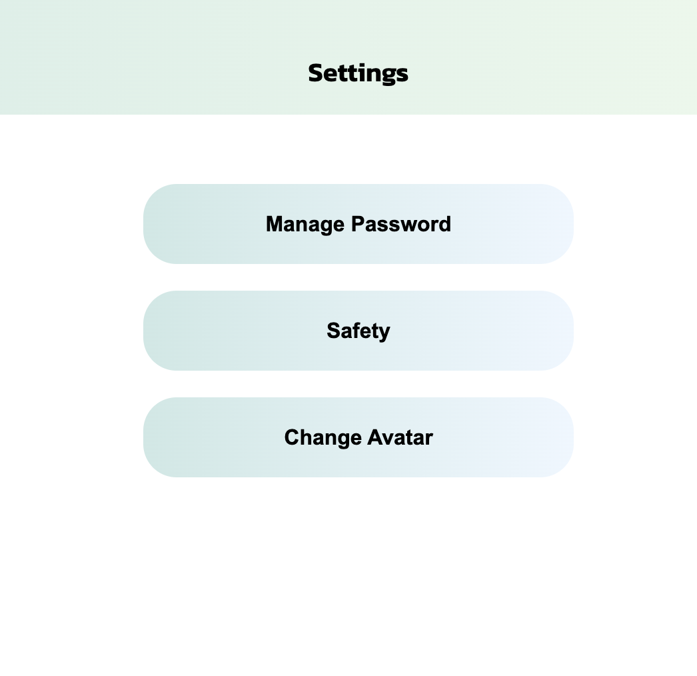

# SplitEase

> _Note:_ This document is meant to be written during (or shortly after) your review meeting, which should happen fairly close to the due date.
>
> _Suggestion:_ Have your review meeting a day or two before the due date. This way you will have some time to go over (and edit) this document, and all team members should have a chance to make their contribution.

## Iteration 02 - Review & Retrospect

- When: July 5,2024
- Where: Online via Zoom

## Process - Reflection

During iteration 2, we managed to setup the more pages for our app, including more features, managing friends and adding groups, showing the transaction and bill split between the user and a friend. 
Our app now features a frontend with over ten pages, two more available features, and comprehensive backend logic matching the frontend.
The group worked together with jobs assigned and each completed their assigned user stories.

#### Decisions that turned out well

1.We added the transaction display split between friends, showing them from either point of view, now a user can check the total balance between them and a friend.
2. We choose to add the option of involving adding and deleting group and friend to ensure the aspect of splitting in our website.
3. We choose to add the change password feature to enhance the user's experience.

#### Decisions that did not turn out as well as we hoped

1. The hesitation between which feature to make slowed the process of development down.
2. Jira was not updated efficiently, and some work was not handed over smoothly.

#### Planned changes

No major planned changes in this iteration.

## Product - Review

#### Goals and/or tasks that were met/completed
1.Completed the feature of adding and deleting a friend/group for a user, the split transactions are now visiable to the user the person who they split with. Added friends detail page so the user can quickly track recent activities with their friends.

2.Completed the changing password feature.

3.Added some buffer page to direct the user more clearly.

#### Goals and/or tasks that were planned but not met/completed

1. We did not complete the feature of choosing how to split the bill with friend/group. This is due to time limitation.

2. We have not yet implemented the feature of changing the user avatar.
   The reason for this is the backend features on this part are not yet implemented.

## Meeting Highlights

Going into the next iteration, our main insights are,

We will aim to implement the following feature in our next iteration:

1. The user can view the transaction details when they click on it.
2. The user can select how to split a transaction, with friends or group, and how to split it.

We will aim to follow the below principles and learn from our previous iteration, these are what we want to improve in the coming iteration:

1. Frontend requires more react understanding. We will mainly focus on fully understanding the react pages and modifying the files into a better structure.
2. We aim to be more smooth in connecting inside a single user story.
3. We aim to update Jira information more often and with more details to create a more clear workflow.
