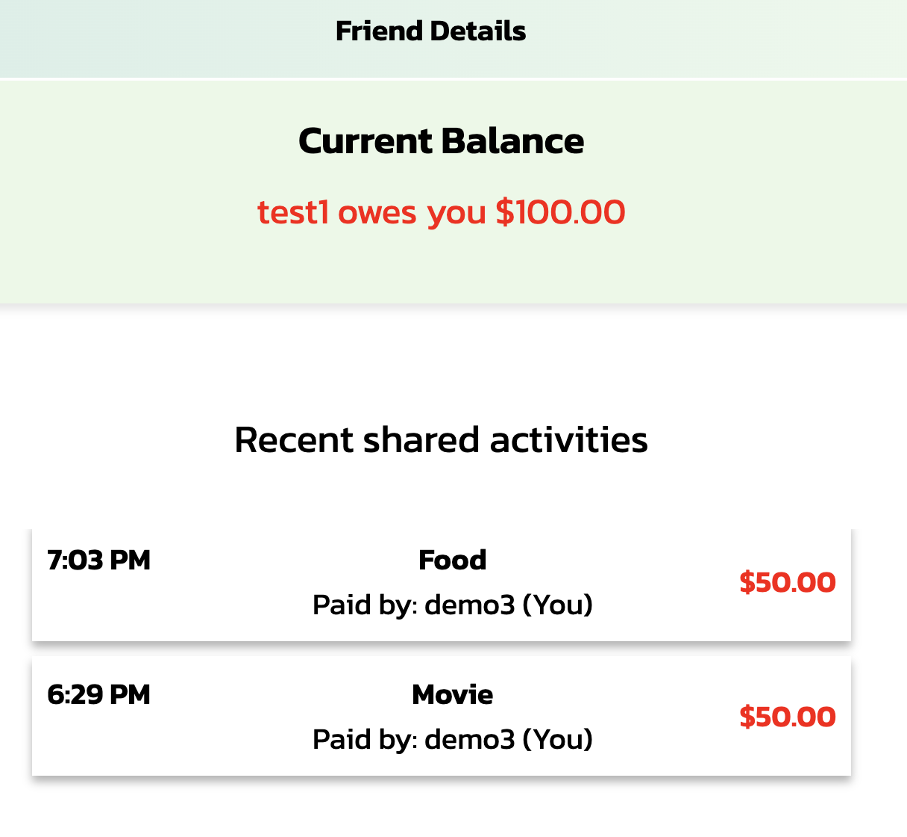
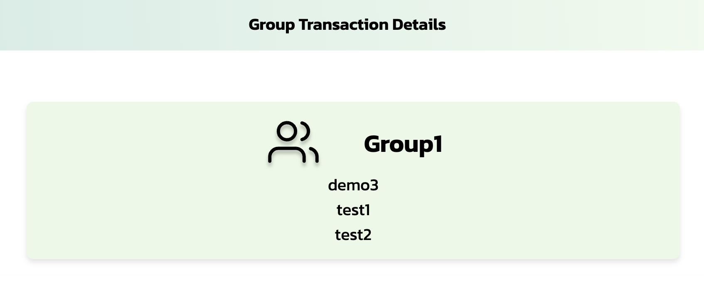
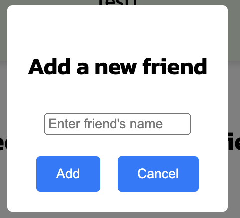
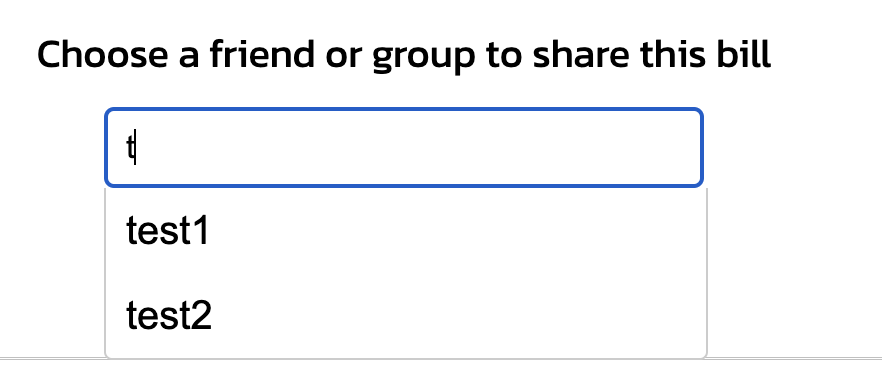
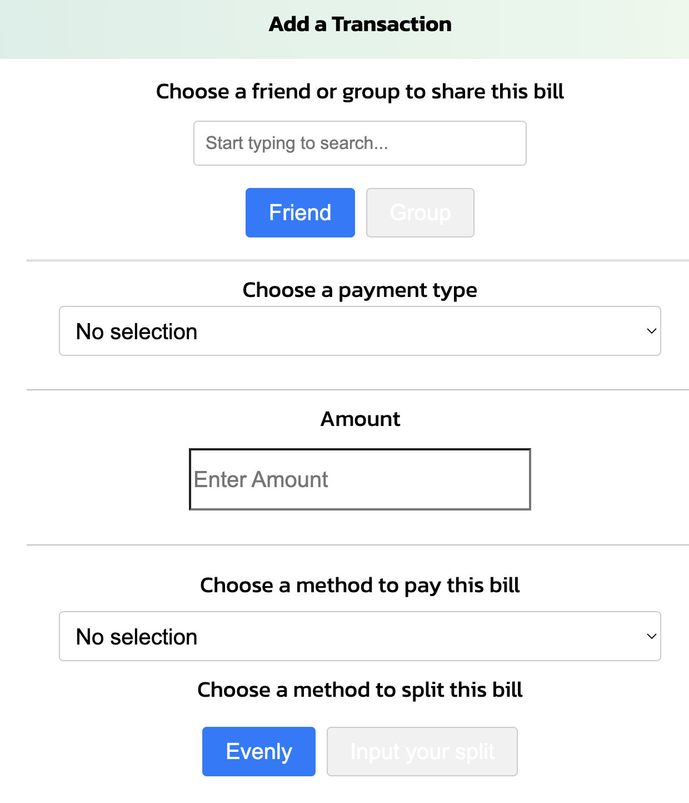
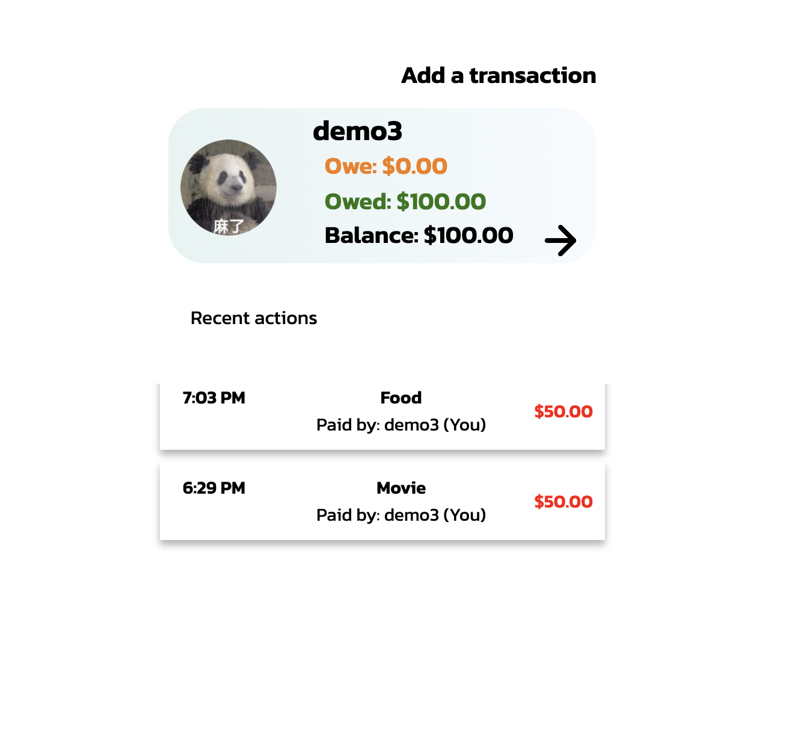

# SplitEase

> _Note:_ This document is meant to be written during (or shortly after) your review meeting, which should happen fairly close to the due date.

>

> _Suggestion:_ Have your review meeting a day or two before the due date. This way you will have some time to go over (and edit) this document, and all team members should have a chance to make their contribution.

## Iteration 03 - Review & Retrospect

- When: July 21, 2024

- Where: Online via Zoom

## Process - Reflection

During iteration 3, we managed to setup the more pages for our app, including more features, the major features we added are viewing the recent transactions with a friend and within a group, so the user can quickly get the information needed. Some small features are added , such as inviting a friend to a group, view the detail of a transaction. We also implemented serval fixes to improve user experience.

Our app now features a frontend with over ten pages, two more available features, and comprehensive backend logic matching the frontend.

The group worked together with jobs assigned and each completed their assigned user stories.

#### Decisions that turned out well

1.We decided to add friend and group detail page for the user to clearly manage their split bills. It was successfully implemented and the outcome was as expected.

2. We took time to look over the small details around the webpage frontend and made minor fixes to improve the user's experience. The pages now looked more consistent.

3. Our backend choose to improve their data structure to enhance the possibility for better feature, such as splitting the bills manually.

#### Decisions that did not turn out as well as we hoped

1. The delay of some frontend designs led to the connection between frontend and backend being held back. This is due to the frontend did not plan the most important tasks first, we will try our best to avoid this next sprint.

#### Planned changes

No major planned changes in this iteration.

## Product - Review

#### Goals and/or tasks that were met/completed

1.Completed the feature of checking group details and friend details, these details include every recent activity that involves this friend/group.

2.Completed the feature to invite friend to a group.

3.Added fixes that increase the user's experience such as, auto filling friend name, etc.

4.Added the feature to view transaction detail.

5.Added more options when adding a transaction, now the user can select friend/group to split the bill, and the way of splitting it.

6. Style of the main page is changed with a closer respect to our Figma design.

#### Goals and/or tasks that were planned but not met/completed

1. We did plan to start the mobile optimization the sprint, but did not plan to finish it due to it being very time consuming.

## Meeting Highlights

Going into the next iteration, our main insights are,

We will aim to implement the following feature in our next iteration:

1. The user can select how to split a transaction, with custom amount to each member involved.
2. Finish started features that are not fully connected in this sprint.

We will aim to follow the below principles and learn from our previous iteration, these are what we want to improve in the coming iteration:

1. Frontend requires more react understanding. We will mainly focus on fully understanding the react pages and modifying the files into a better structure.

2. We aim to wrap up a lot of design choices near the finishing of our project.
3. We aim to finish the features we started but are not done.
